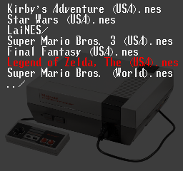
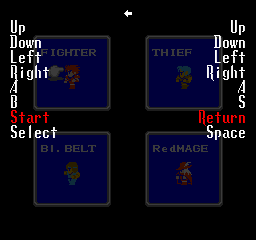
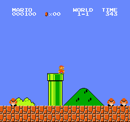
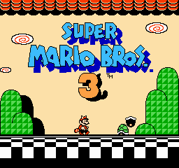
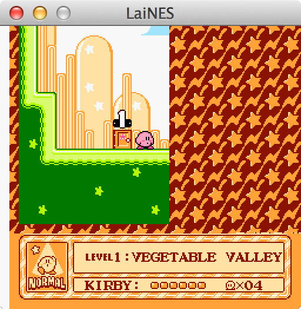
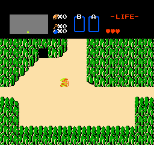
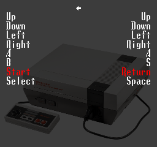

LaiNES
======

Compact, cycle-accurate NES emulator in ~1000 actual lines of C++ (libraries and scaffolding excluded).









## Requirements
LaiNES should run on any Unix system that is compatible with the following tools.
- SConstruct
- C++11 compatible compiler (e.g. clang++)
- SDL2 (including sdl2-ttf and sdl2-image)

## Building and running
Install the dependencies:
```sh
# Debian-based systems:
sudo apt-get install clang scons libsdl2-dev libsdl2-image-dev libsdl2-ttf-dev

# Mac OS X:
brew install scons sdl2 sdl2_image sdl2_ttf
```

Compile and run:
```sh
git clone https://github.com/AndreaOrru/LaiNES && cd LaiNES
scons
./laines
```

## Usage
The emulator comes bundled with a simple GUI to navigate the filesystem and set preferences. Use arrow keys and Enter to operate it. ESC toggles between emulation and menu.

The size of the window and the controls are customizable. LaiNES supports multiple controllers and should work with joysticks as well. The default controls for the first player are as follows:


## Compatibility
LaiNES implements the most common mappers, which should be enough for a good percentage of the games:
- NROM
- MMC1 (SxROM)
- MMC3, MMC6 (TxROM)

You can check the compatibility for each ROM in the following list:
http://tuxnes.sourceforge.net/nesmapper.txt

## Technical notes
The 6502 CPU and the PPU are implemented in just 219 and 283 lines of code respectively.
Some clever meta-programming tricks are used to keep the codebase compact.
Here is a good example of how this is achieved:
```c++
/* Cycle emulation.
 *     For each CPU cycle, we call the PPU thrice, because it runs at 3 times the frequency. */
#define T   tick()
inline void tick() { PPU::step(); PPU::step(); PPU::step(); ... }
...

/* Addressing modes.
 *     These are all the possible ways instructions can access memory. */
typedef u16 (*Mode)(void);
inline u16 imm() { return PC++; }
...
inline u16 zpx() { T; return (zp() + X) % 0x100; }
...

/* Fetch parameter.
 *     Get the address of the opcode parameter in a, and the value in p. */
#define G  u16 a = m(); u8 p = rd(a)
...

/* Instruction emulation (LDx where x is in registers {A, X, Y}).
 *     upd_nz, not shown, just updates the CPU flags register. */
template<u8& r, Mode m> void ld() { G; upd_nz(r = p); }
...

/* Execute a CPU instruction.
 *     Opcodes are instantiated with the right template parameters
 *     (i.e. register and/or addressing mode).*/
void exec()
{
    switch (rd(PC++))  // Fetch the opcode.
    {
        // Select the right function to emulate the instruction:
         ...
         case 0xA0: return ld<Y,imm>();  case 0xA1: return ld<A,izx>();
         ...
    }
}
```

## Known issues
Some people are having problems with the audio emulation on Linux.
I couldn't reproduce it, but pull requests to fix it are more than welcome.

## External documentation
- Complete hardware reference: http://problemkaputt.de/everynes.htm
- Tick-by-tick breakdown of 6502 instructions: http://nesdev.com/6502_cpu.txt
- Diagram of the PPU state machine: http://wiki.nesdev.com/w/images/d/d1/Ntsc_timing.png
- blargg's APU sound chip emulator: http://blargg.8bitalley.com/libs/audio.html#Nes_Snd_Emu
